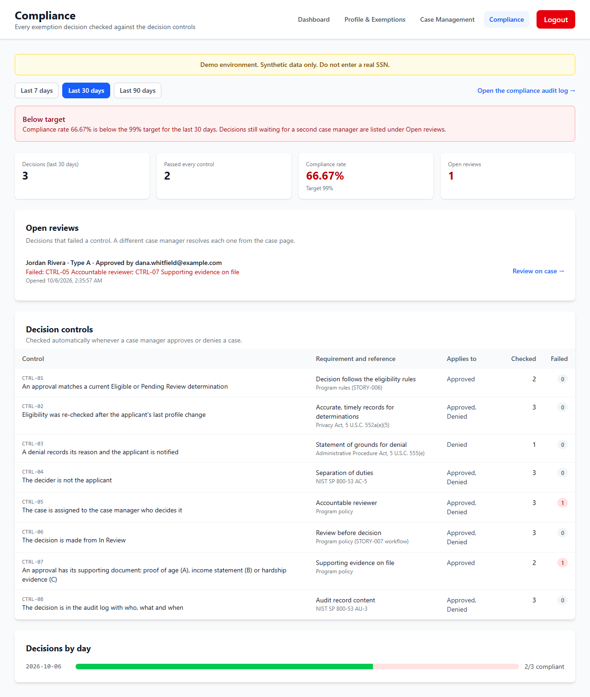
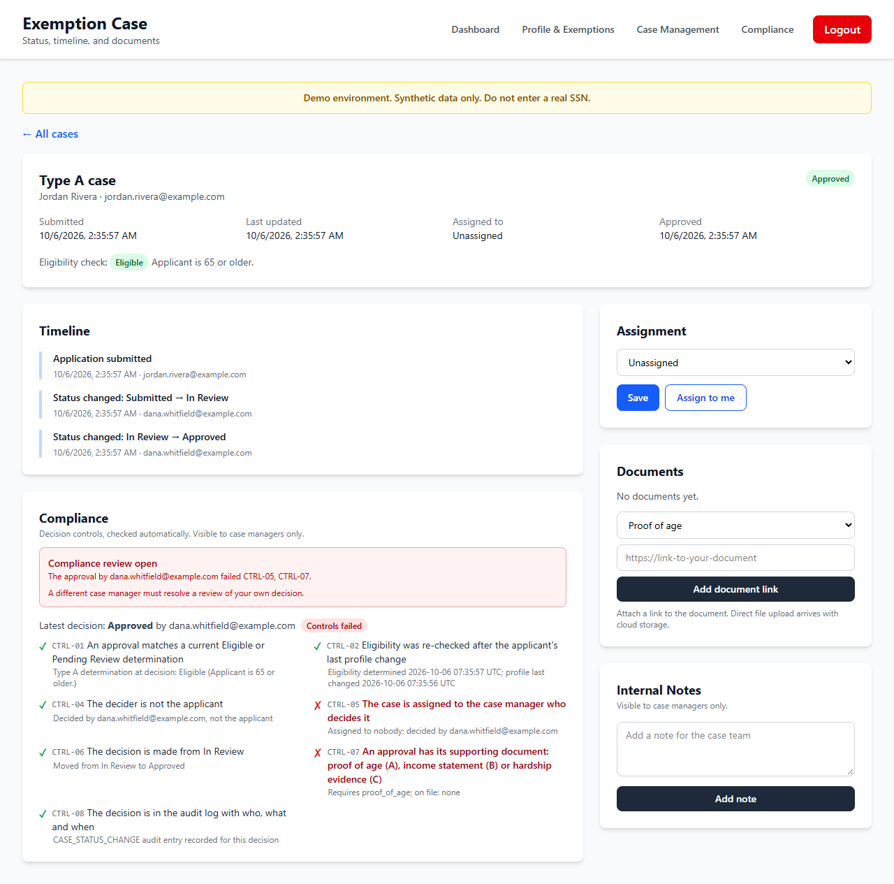
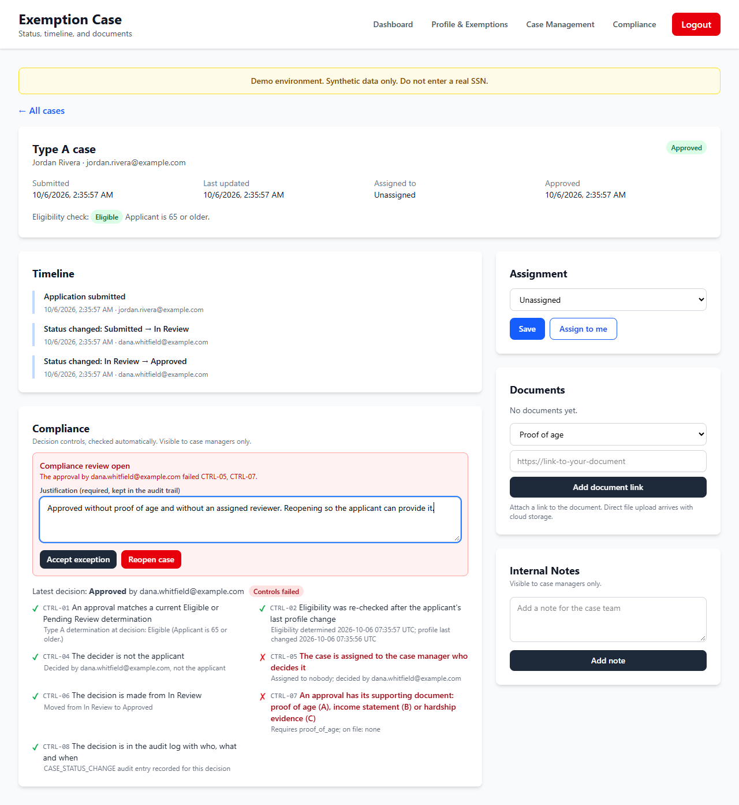
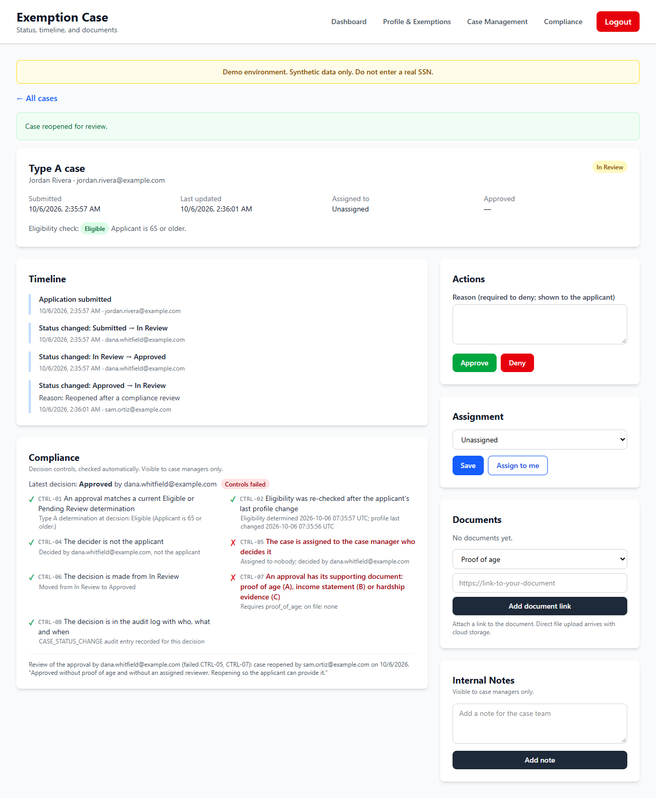
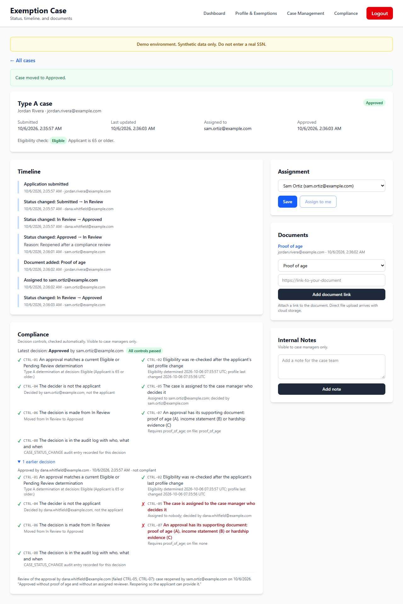
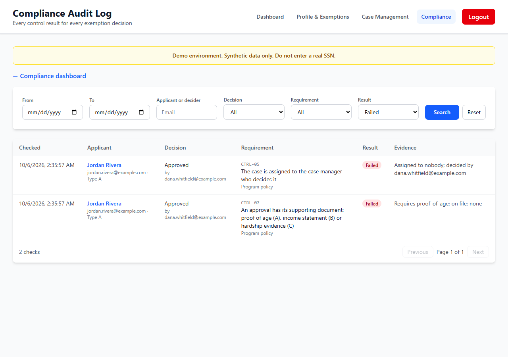
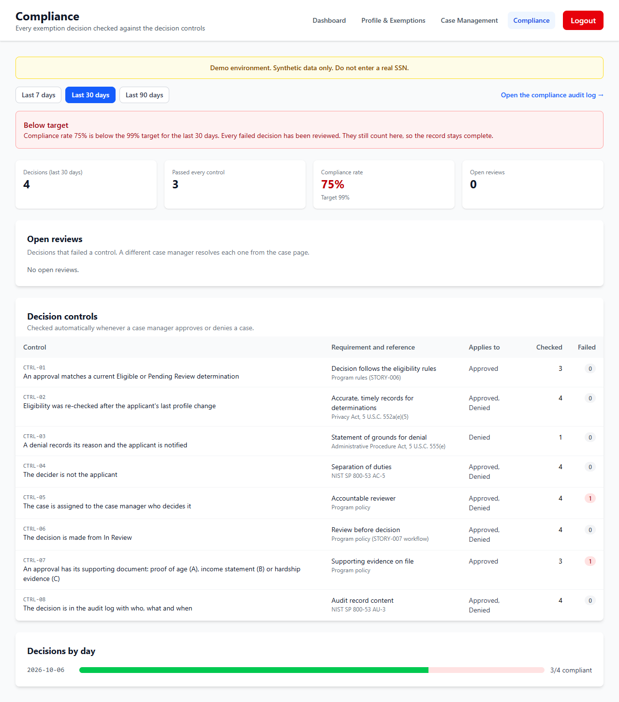
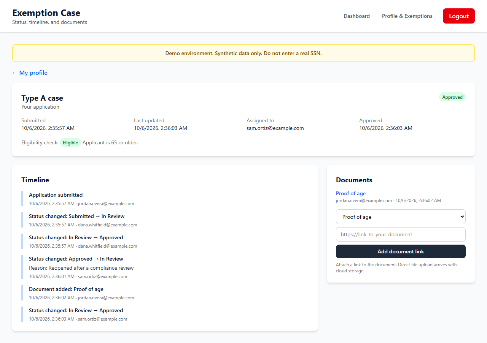
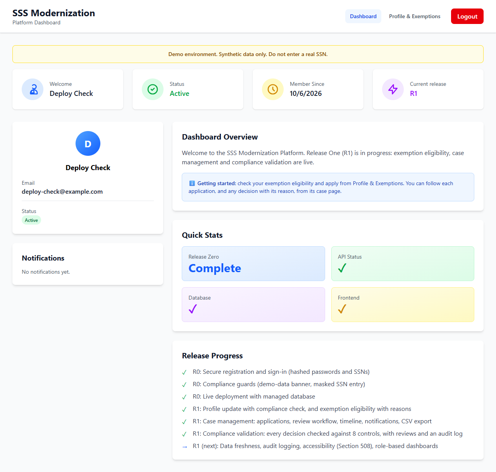
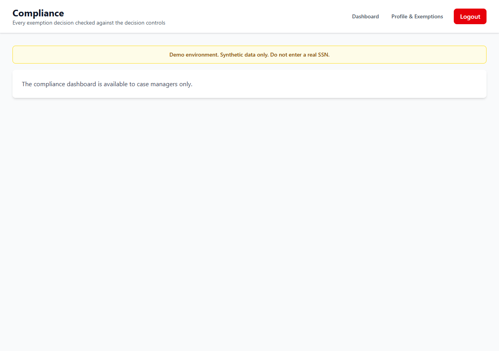

# STORY-008 Compliance Matrix Validation: evidence

STORY-008 is live. Every exemption decision is checked against 8 decision controls at the moment a case manager approves or denies it. A decision that fails any control opens a compliance review that only a different case manager can resolve, with a written justification: accept the exception (recorded as an override in the audit log) or reopen the case (back to In Review, with the applicant notified). The results feed a compliance dashboard with a 99% target and an alert below it, and a filterable audit log of every control result.

Screens 1 to 8 come from an automated run that seeds synthetic cases through the API, resolves the review through the real UI in headless Chrome and checks what each screen shows. It ran locally on the code that is now live (commits ac9dab3 and 6500c38), because the live site has no test case-manager accounts. Screens 9 and 10 are the live site after the deploy.

## Checks

- Live deploy (scripts/verify-deploy.mjs): the API serves 50e0769 and the site e302dbf, the newest change to each; database ok; 13 migrations applied; all 27 protected GET routes answer 401 without a token.
- Live, signed in as a synthetic citizen (scripts/verify-live-citizen.mjs): all 15 staff GET routes answer 403; the control list is readable; no Compliance link.
- UI run (scripts/evidence/story-008.mjs): 16 checks passed while capturing screens 1 to 8, with the review resolved through the real UI.
- API end to end, local (scripts/e2e): 87 checks passed: access 31, case workflow 26, compliance 30.
- Unit tests: 154 passed, including 133 route-access checks and 13 compliance-control tests.

## Screens

### 1. Compliance dashboard: below target, one open review

Sam Ortiz, a case manager, opens Compliance. One of the three decisions so far failed two controls, so the rate is 66.67% against the 99% target and the alert is raised. The failing decision is listed under Open reviews with the controls it failed.

### 2. The deciding manager sees what failed and cannot clear it

Dana Whitfield approved Jordan Rivera's case while it was unassigned and without proof of age. The case page shows CTRL-05 and CTRL-07 failed, with the evidence for every control. The deciding manager cannot resolve a review of their own decision (NIST AC-5), and the API refuses it as well.

### 3. A second case manager must justify the outcome

Sam opens the same case. A written justification is required before either action: Accept exception (recorded as an override in the audit log) or Reopen case.

### 4. Case reopened

Sam reopens the case. Its status returns to In Review, the timeline records why, the applicant is notified, and the review closes with Sam's note.

### 5. Decided again, compliantly; the failed decision stays on record

Jordan adds proof of age; Sam takes the case (Assign to me) and approves it from the case page. All 7 controls that apply to an approval pass. The earlier failed decision and its review remain visible.

### 6. Compliance audit log

Every control result for every decision, filterable by date range, applicant or decider, decision, control and result. Filtered here to failures: the two failed checks from the first decision.

### 7. Dashboard after the review

No open reviews remain. The failed decision still counts in the rate (3 of 4, 75%), so the record cannot be cleaned up after the fact.

### 8. What the applicant sees

Jordan sees the status, the reason the case was reopened and the new approval, but no compliance panel or Compliance link. The compliance API returns 403 to applicants.

### 9. Live site: a citizen's dashboard

https://sss-demo-frontend.onrender.com after the deploy, signed in as a synthetic citizen: compliance validation shows as done and there is no Compliance link.

### 10. Live site: a citizen opening /compliance

The page refuses, and the live API behind it answers 403 to a citizen on all 15 staff routes.

## Notes

- The controls: CTRL-01 the approval matches a current eligibility determination; CTRL-02 eligibility was re-checked after the applicant's last profile change (Privacy Act, 5 U.S.C. 552a(e)(5)); CTRL-03 a denial records its reason and notifies the applicant (APA, 5 U.S.C. 555(e)); CTRL-04 the decider is not the applicant (NIST SP 800-53 AC-5); CTRL-05 the case is assigned to the case manager who decides it; CTRL-06 the decision is made from In Review; CTRL-07 the required document is on file (proof of age, income statement or hardship evidence); CTRL-08 the decision is in the audit log with who, what and when (NIST SP 800-53 AU-3).
- Decisions made before this release have no control results, so the live dashboard starts empty and fills as cases are decided.
- Known gap, before any real data: the case-manager role is granted from an email list on the server without verifying that the person owns the address. Staff roles need verified identities (email verification or admin-assigned roles) before production.
- All data shown is synthetic.

_Built by `scripts/evidence/report.mjs` from `evidence.json`. Screenshots by `scripts/evidence/story-008.mjs (screens 1-8) and scripts/verify-live-citizen.mjs (screens 9-10)`._
